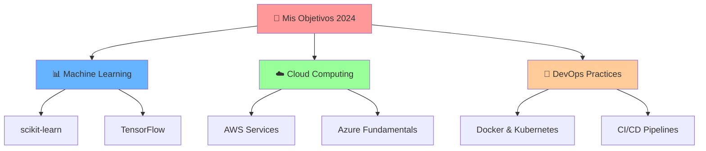

<div align="center">
  
</div>

<div align="center">
  
</div>

---

<div align="center">

### 🎯 **OBJETIVOS PROFESIONALES**

</div>

<table align="center">
<tr>
<td width="25%" align="center">

<br><strong>Data Analyst</strong>
<br><sub>ML & Visualización</sub>
</td>
<td width="25%" align="center">

<br><strong>DevOps Engineer</strong>
<br><sub>CI/CD & Cloud</sub>
</td>
<td width="25%" align="center">

<br><strong>Backend Dev</strong>
<br><sub>APIs & Sistemas</sub>
</td>
<td width="25%" align="center">

<br><strong>Automation</strong>
<br><sub>Workflows & Scripts</sub>
</td>
</tr>
</table>

---

<div align="center">

## 🛠️ **STACK TECNOLÓGICO**

### 💻 Lenguajes de Programación

</div>

<div align="center">
  
</div>

<div align="center">

### 🔧 Herramientas y Tecnologías

</div>

<div align="center">
  
</div>

<div align="center">

### 📊 Data Science & Analytics

</div>

<div align="center">
  
  
  
  
</div>

---

<div align="center">

## 📈 **MI ENFOQUE ACTUAL**

</div>

```python
class AngelCalero:
    def __init__(self):
        self.name = "Ángel Calero"
        self.location = "Puebla, México 🇲🇽"
        self.education = "Estudiante TICs - ITP"
        self.role = "Aspiring Data Analyst & DevOps Engineer"
        
        self.tech_stack = {
            "languages": ["Python", "JavaScript", "Java", "PHP", "HTML"],
            "databases": ["MySQL", "PostgreSQL"],
            "tools": ["Docker", "Git", "Linux", "VS Code"],
            "learning": ["Machine Learning", "AWS", "Kubernetes", "CI/CD"]
        }
        
    def get_current_status(self):
        return {
            "🎓 studying": "Algoritmos y Estructuras de Datos",
            "🔨 building": "Proyectos de Análisis de Datos",
            "🌱 exploring": "DevOps Tools & Cloud Computing",
            "📚 reading": "Clean Code & Design Patterns"
        }
        
    def get_goals_2024(self):
        return [
            "🎯 Dominar Machine Learning con Python",
            "☁️ Certificarme en AWS Cloud Practitioner", 
            "🐳 Implementar CI/CD con Docker & GitHub Actions",
            "📊 Crear dashboard interactivos con datos reales"
        ]
```

<div align="center">

---

## 📊 **GITHUB ANALYTICS**


</div>

<div align="center">


</div>

<div align="center">

---

## 🚀 **PROYECTOS DESTACADOS**

</div>

<div align="center">
<table>
<tr>
<td width="50%">

### 📊 Data Analysis Portfolio
```python
# Análisis exploratorio de datos
import pandas as pd
import matplotlib.pyplot as plt
import seaborn as sns

def analyze_dataset(data):
    insights = data.describe()
    visualizations = create_plots(data)
    return insights, visualizations
```
**Tech:** Python • Pandas • Matplotlib • Jupyter

</td>
<td width="50%">

### 🔧 DevOps Automation
```bash
#!/bin/bash
# Script de automatización
docker build -t myapp:latest .
docker run -d -p 8080:80 myapp:latest

echo "✅ Deployment completed!"
```
**Tech:** Docker • Bash • Linux • Git Actions

</td>
</tr>
<tr>
<td width="50%">

### 🌐 Backend API Development
```javascript
// API RESTful con Node.js
app.get('/api/data', async (req, res) => {
  try {
    const data = await DataService.getAll();
    res.json({ success: true, data });
  } catch (error) {
    res.status(500).json({ error: error.message });
  }
});
```
**Tech:** Node.js • Express • MySQL • JWT

</td>
<td width="50%">

### 📱 Full Stack Applications  
```php
<?php
// Backend con PHP
class DataController {
    public function index() {
        $data = $this->model->getAllData();
        return $this->response($data);
    }
}
```
**Tech:** PHP • JavaScript • HTML • CSS

</td>
</tr>
</table>
</div>

<div align="center">

---

## 🌟 **LO QUE ME DIFERENCIA**

</div>

<div align="center">
<table>
<tr>
<td align="center" width="33%">

<br><strong>Background Creativo</strong>
<br><sub>Diseño gráfico aplicado a<br>visualización de datos</sub>
</td>
<td align="center" width="33%">

<br><strong>Pensamiento Analítico</strong>
<br><sub>Enfoque metodológico<br>para resolver problemas</sub>
</td>
<td align="center" width="33%">

<br><strong>Mejora Continua</strong>
<br><sub>Siempre aprendiendo<br>nuevas tecnologías</sub>
</td>
</tr>
</table>
</div>

<div align="center">

---

## 🌱 **ACTUALMENTE APRENDIENDO**

</div>

<div align="center">



</div>

<div align="center">

---

## 📱 **CONECTEMOS**

[](https://linkedin.com/in/tu-perfil)
[](mailto:tu.email@ejemplo.com)
[](https://github.com/CaleroAM)
[](https://twitter.com/tu-usuario)

</div>

<div align="center">

---

### 💡 *"Los datos cuentan historias, el código las hace realidad"*


⭐️ **¿Te gusta mi trabajo? ¡Dale star a mis repositorios!**

</div>

---

<div align="center">
  
</div>
